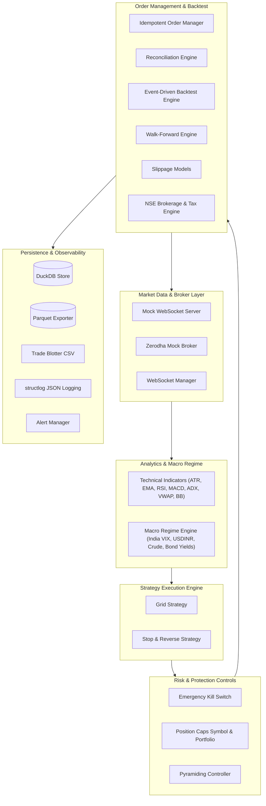
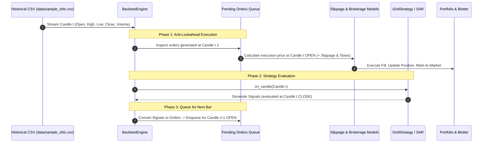
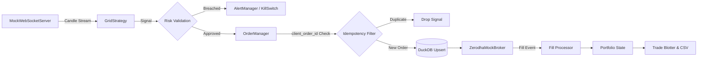

# Quantitative Trading Engine

> A modular, production-oriented algorithmic trading engine in Python 3.12, featuring ATR-based grid execution, stop-and-reverse strategies, macro regime scoring, strict risk controls, event-driven backtesting with anti-lookahead enforcement, and crash recovery with DuckDB.

---

## Table of Contents

1. [Executive Summary](#executive-summary)
2. [Architecture & System Design](#architecture--system-design)
3. [Component Deep Dive](#component-deep-dive)
   - [Strategy Engine (Grid & Stop-and-Reverse)](#strategy-engine-grid--stop-and-reverse)
   - [Technical Indicators Engine](#technical-indicators-engine)
   - [Macro Regime Engine](#macro-regime-engine)
   - [Risk Management & Circuit Breakers](#risk-management--circuit-breakers)
   - [Broker Abstraction & Simulation](#broker-abstraction--simulation)
   - [Order Lifecycle, Idempotency & Crash Recovery](#order-lifecycle-idempotency--crash-recovery)
   - [Backtesting & Walk-Forward Framework](#backtesting--walk-forward-framework)
   - [Indian Market Transaction Cost Model](#indian-market-transaction-cost-model)
   - [Storage & Observability](#storage--observability)
4. [Data & Execution Flows](#data--execution-flows)
5. [Assignment Requirements Mapping](#assignment-requirements-mapping)
6. [Simulated vs. Real Components](#simulated-vs-real-components)
7. [Installation & Setup](#installation--setup)
8. [CLI Usage & Execution Modes](#cli-usage--execution-modes)
9. [Automated Testing & Coverage](#automated-testing--coverage)
10. [AI SDLC Utilities](#ai-sdlc-utilities)
11. [Design Rationale & Engineering Decisions](#design-rationale--engineering-decisions)
12. [Known Limitations & Future Roadmap](#known-limitations--future-roadmap)

---

## Executive Summary

This repository contains an end-to-end quantitative trading system implemented in Python 3.12 adhering to Clean Architecture principles. It was designed to demonstrate institutional-style patterns in algorithmic trading:

* **Event-Driven Architecture**: Separation of market data ingestion, signal evaluation, order dispatching, and position bookkeeping.
* **Capital Protection by Default**: Hard stop losses, dynamic ATR spacing, pyramid layer constraints, portfolio exposure caps, and an emergency kill switch.
* **Realistic Market Simulation**: Event-driven backtesting that strictly prohibits look-ahead bias, simulates slippage, and calculates statutory Indian exchange costs (STT, Exchange Turnover, SEBI, GST, Stamp Duty).
* **Defensive Order Management**: Deterministic client order identification (`client_order_id`), deduplication, ACID state persistence in DuckDB, and broker state reconciliation across system restarts.

---

## Architecture & System Design

The system is organized into decoupled layers where core domain entities have zero external dependencies. Strategies depend only on pure data models, allowing the exact same strategy code to execute within a live simulation or an event-driven backtest.



### Directory Structure

```text
quant_engine/
├── app/
│   ├── core/                  # Configuration (Pydantic Settings) & structured logging
│   │   ├── config.py
│   │   └── logger.py
│   ├── domain/                # Core entities, immutable models, enums & events
│   │   ├── enums.py           # OrderStatus, Side, MarketRegime, SignalAction, etc.
│   │   ├── events.py          # Domain events (KillSwitchEvent, RegimeChangeEvent)
│   │   └── models.py          # Candle, Tick, Order, Fill, Trade, Position, Portfolio, Signal
│   ├── indicators/            # Pure vectorised technical indicators (NumPy)
│   │   ├── adx.py             # ADX, DI+, DI- (Wilder smoothing)
│   │   ├── atr.py             # Average True Range
│   │   ├── bollinger.py       # Bollinger Bands (SMA ± k×σ)
│   │   ├── ema.py             # Exponential Moving Average
│   │   ├── macd.py            # MACD Line, Signal Line, Histogram
│   │   ├── rsi.py             # Relative Strength Index (Wilder)
│   │   └── vwap.py            # Volume-Weighted Average Price
│   ├── strategy/              # Execution strategies
│   │   ├── base.py            # Abstract BaseStrategy interface
│   │   ├── grid.py            # ATR-spaced grid trading with pyramiding & TP/SL
│   │   └── stop_reverse.py    # Parabolic SAR trailing stop-and-reverse
│   ├── risk/                  # Risk controls & circuit breakers
│   │   ├── kill_switch.py     # Global kill switch (loss, drawdown, manual)
│   │   ├── position_cap.py    # Max position units & gross portfolio exposure
│   │   └── pyramiding.py      # Layer validation & step-spacing enforcement
│   ├── macro/                 # Macroeconomic regime classification
│   │   ├── regime.py          # MacroRegimeEngine (overrides & circuit breaker)
│   │   └── scoring.py         # Multi-proxy scoring (VIX, USDINR, Crude, Yield)
│   ├── broker/                # Broker abstraction & simulation
│   │   ├── base.py            # Abstract BrokerBase interface
│   │   ├── zerodha_mock.py    # Mock Zerodha Kite Connect REST/WS API
│   │   └── websocket.py       # WebSocketManager (reconnection/heartbeat) & MockServer
│   ├── execution/             # Order lifecycle management
│   │   ├── fills.py           # Fill processing & position adjustment
│   │   ├── order_manager.py   # Idempotent order dispatcher with DuckDB sync
│   │   └── reconciliation.py  # Local state vs broker book reconciliation
│   ├── backtest/              # Backtesting & validation
│   │   ├── engine.py          # Bar-by-bar event engine (anti-lookahead)
│   │   ├── walkforward.py     # Rolling train/test window framework
│   │   ├── slippage.py        # Fixed & volume-based slippage models
│   │   └── brokerage.py       # NSE cash/intraday statutory charge calculator
│   ├── storage/               # Persistence layer
│   │   ├── duckdb_store.py    # Embedded DuckDB CRUD for orders, trades, snapshots
│   │   └── parquet.py         # PyArrow columnar Parquet export with Snappy compression
│   ├── monitoring/            # Observability & reporting
│   │   ├── alerts.py          # AlertManager (Console, webhook, structured log)
│   │   └── trade_blotter.py   # In-memory trade ledger & CSV blotter export
│   └── agents/                # AI SDLC productivity utilities
│       ├── commit_writer.py   # Git diff analyser → Conventional Commit message
│       └── test_generator.py  # Changed files → targeted pytest execution command
├── data/
│   ├── sample_ohlc.csv        # 500 synthetic NIFTY daily bars
│   └── macro.csv              # 100 historical macro proxy readings
├── docs/
│   └── INTERVIEW_GUIDE.md     # Deep architectural & quant interview guide
├── tests/                     # 136 automated regression tests
├── pyproject.toml             # Poetry project configuration & dependencies
├── .env.example               # Environment variables configuration template
├── .gitignore                 # Excludes secrets, databases, coverage, caches
└── main.py                    # Application CLI entry point
```

---

## Component Deep Dive

### Strategy Engine (Grid & Stop-and-Reverse)

1. **ATR-Based Grid Strategy (`app/strategy/grid.py`)**
   * **Dynamic Spacing**: Computes price levels based on market volatility: `Spacing = ATR(14) × grid_atr_multiplier`.
   * **Level Generation**: Establishes symmetric buy and sell bands anchored to a reference price upon warm-up.
   * **Order Triggering**: Generates `ENTER_LONG` when the price touches lower levels and `ENTER_SHORT` on upper levels.
   * **Take-Profit & Stop-Loss**: Evaluates exits at each candle close based on `TP = Entry ± (ATR × tp_mult)` and `SL = Entry ∓ (ATR × sl_mult)`.
   * **Pyramiding Integration**: Verifies entry criteria through the `PyramidingController` before issuing additional scale-in orders.

2. **Stop-and-Reverse Strategy (`app/strategy/stop_reverse.py`)**
   * Implements a state-reversing trailing mechanism.
   * Maintains active market direction (`LONG` or `SHORT`).
   * When an adverse price threshold or trailing trigger is penetrated, the engine closes the active position and enters the opposing direction via a single `REVERSE_TO_LONG` or `REVERSE_TO_SHORT` signal.

### Technical Indicators Engine

All indicators in `app/indicators/` are implemented using vectorised NumPy routines. Calculations avoid library bloat, guarantee determinism, and eliminate code duplication.

* **Trend**:
  * **EMA (`ema.py`)**: Exponential moving average with smoothing multiplier $\alpha = \frac{2}{\text{period} + 1}$.
  * **MACD (`macd.py`)**: Computes Fast EMA (12), Slow EMA (26), MACD line, 9-period Signal line, and difference Histogram.
  * **ADX (`adx.py`)**: Computes True Range, Directional Movement ($+DM$, $-DM$), smoothed $+DI$, $-DI$, and the normalized Average Directional Index using Wilder smoothing.
* **Momentum**:
  * **RSI (`rsi.py`)**: Relative Strength Index with Wilder smoothing over average gains and losses.
* **Volatility**:
  * **ATR (`atr.py`)**: Average True Range based on max of High-Low, |High-PrevClose|, |Low-PrevClose|.
  * **Bollinger Bands (`bollinger.py`)**: 20-period SMA middle band with upper/lower bands offset by $k \times \sigma$ (default $k=2$).
* **Volume**:
  * **VWAP (`vwap.py`)**: Intraday/session cumulative $\frac{\sum (\text{Typical Price} \times \text{Volume})}{\sum \text{Volume}}$.

### Macro Regime Engine

The Macro Regime Engine (`app/macro/`) monitors systematic market conditions to protect capital against regime shifts:

1. **Proxy Ingestion (`scoring.py`)**: Reads four core Indian macro indicators:
   * **India VIX**: Volatility and equity fear gauge.
   * **USD/INR**: FX depreciation and capital outflow pressure.
   * **Brent Crude Oil**: Energy import cost and domestic inflation driver.
   * **10Y Indian Government Bond Yield**: Sovereign yield and liquidity indicator.
2. **Regime Classification**: Composite z-scores categorize the environment into one of five states:
   * `BULL_TREND`, `BEAR_TREND`, `HIGH_VOLATILITY`, `LOW_VOLATILITY`, `CRISIS`.
3. **Dynamic Parameter Overrides (`regime.py`)**:
   * Under `HIGH_VOLATILITY`: Automatically widens grid spacing by $1.5\times$ to avoid premature stop-outs and scales position sizing down by $50\%$.
   * Under `CRISIS` (e.g. VIX $> 35$ or steep multi-asset divergence): Engages a system-wide circuit breaker that halts new entries and enforces position de-risking.

### Risk Management & Circuit Breakers

* **Emergency Kill Switch (`app/risk/kill_switch.py`)**:
  * Evaluates three safety bounds on every trade:
    1. Maximum Daily Loss (INR ceiling).
    2. Maximum Consecutive Losses.
    3. Maximum Peak-to-Trough Equity Drawdown percentage.
  * Employs the **Observer Pattern**: registered listeners (e.g., `OrderManager.cancel_all()`) execute defensive actions immediately upon breach.
  * Supports idempotent manual triggers and administrative resets.
* **Position Cap Controller (`app/risk/position_cap.py`)**:
  * Validates single-symbol maximum quantity caps.
  * Enforces total portfolio gross notional exposure limits before any order is submitted.
* **Pyramiding Controller (`app/risk/pyramiding.py`)**:
  * Restricts maximum active layers (scale-ins) per symbol.
  * Enforces minimum price separation between successive entries.
  * Rejects signals that attempt to pyramid into an unconfirmed or non-profitable position unless configured for dollar-cost averaging.

### Broker Abstraction & Simulation

* **Abstract Broker Base (`app/broker/base.py`)**: Defines an asynchronous contract:
  ```python
  class BrokerBase(ABC):
      async def connect(self) -> bool: ...
      async def disconnect(self) -> None: ...
      async def place_order(self, order: Order) -> Order: ...
      async def cancel_order(self, order: Order) -> Order: ...
      async def orders(self) -> list[Order]: ...
      async def positions(self) -> list[Position]: ...
      async def stream_ticks(self, symbols: list[str]) -> AsyncIterator[Tick]: ...
  ```
* **Zerodha Mock Broker (`app/broker/zerodha_mock.py`)**:
  * Implements Zerodha Kite Connect REST API semantics in memory.
  * Supports deterministic order placement, simulated fills, cancellations, and order state queries.
  * Features configurable micro-structure simulation: market-order slippage (in bps), partial fills, and limit order rejection probability.
* **WebSocket Management (`app/broker/websocket.py`)**:
  * `WebSocketManager`: Handles automatic reconnection with exponential backoff and heartbeat monitoring.
  * `MockWebSocketServer`: Streams synthetic OHLCV candles generated via geometric Brownian motion random walk for local integration testing.

### Order Lifecycle, Idempotency & Crash Recovery

Financial systems must prevent duplicate order dispatch during network timeouts or engine restarts.

```mermaid
flowchart TD
    subgraph OrderSubmission["Order Submission & Idempotency"]
        SIG[Strategy Signal] --> GEN[Create Order with unique client_order_id]
        GEN --> CHK{client_order_id already in cache / DuckDB?}
        CHK -->|Yes: Duplicate| DROP[Block duplicate & return tracked order]
        CHK -->|No: New| PERSIST[Persist Order as PENDING in DuckDB]
        PERSIST --> SEND[Dispatch to Broker]
        SEND --> RESP{Broker Response}
        RESP -->|Filled| MARK_FILL[Update FILLED in DuckDB & Blotter]
        RESP -->|Rejected| MARK_REJ[Update REJECTED in DuckDB]
    end

    subgraph CrashRecovery["Crash Recovery & Reconciliation"]
        BOOT[Engine Startup] --> RECOVER[OrderManager.restore_from_db]
        RECOVER --> READ[Load non-terminal orders from DuckDB]
        READ --> POPULATE[Populate in-memory tracking cache]
        POPULATE --> RECONCILE[ReconciliationEngine.reconcile_orders]
        RECONCILE --> PULL[Fetch active orders from Broker]
        PULL --> DIFF{Local vs Broker Mismatch?}
        DIFF -->|Yes| SYNC[Update local state to match broker & log]
        DIFF -->|No| RESUME[Resume normal execution]
    end
```



1. **Idempotent Submission (`OrderManager.submit`)**:
   * Every order receives a deterministic or unique `client_order_id`.
   * An asynchronous lock protects internal registries: duplicate submissions return the existing order object rather than placing a duplicate trade with the broker.
2. **Crash Recovery (`restore_from_db`)**:
   * On engine reboot, `DuckDBStore.load_open_orders()` retrieves all non-terminal orders (`SUBMITTED`, `PENDING`, `OPEN`).
   * In-memory order tracking is rebuilt without losing state.
3. **State Reconciliation (`ReconciliationEngine.reconcile_orders`)**:
   * Compares the restored local state against the broker's order book.
   * If an order was filled while the local engine was offline, the reconciliation engine syncs the local status, creates fill records, marks positions to market, and logs the discrepancy.

### Backtesting & Walk-Forward Framework



#### Strict Anti-Lookahead Bias Protection
A pervasive flaw in naïve backtest implementations is executing a signal at the closing price of the bar that generated it. In reality, a strategy calculating signals on bar $t$'s close can only execute on bar $t+1$'s open at the earliest.
* In `BacktestEngine.run()`:
  1. **Step 1**: Pending orders from bar $t-1$ are filled at bar $t$'s **Open** price (subject to slippage).
  2. **Step 2**: The strategy observes bar $t$'s completed candle and produces signals.
  3. **Step 3**: Signals are converted to orders and queued as pending for bar $t+1$.
  4. **Step 4**: Active positions are marked-to-market at bar $t$'s **Close**.

#### Walk-Forward Engine (`app/backtest/walkforward.py`)
To prevent in-sample overfitting:
* Partitions historical data into rolling windows (e.g., 100 training bars, 50 out-of-sample testing bars, stepping forward by 50 bars).
* **Indicator Warm-Up**: During the train window, the strategy receives bars to build warm indicator buffers (EMA, ATR, ADX), but trades are not counted in out-of-sample statistics.
* **Out-of-Sample Evaluation**: Only trades executed during the unseen test segment contribute to performance metrics (Sharpe ratio, win rate, net P&L).

### Indian Market Transaction Cost Model

Backtests calculate realistic transaction friction modeled after Indian exchange rules (`app/backtest/brokerage.py`):

| Cost Component | Equity Intraday (MIS) | Equity Delivery (CNC) | Futures |
|---|---|---|---|
| **Brokerage** | $\min(₹20, 0.03\% \times \text{Turnover})$ | Zero / ₹20 | $\min(₹20, 0.03\% \times \text{Turnover})$ |
| **STT / CTT** | $0.025\%$ on Sell side | $0.1\%$ on Buy & Sell | $0.0125\%$ on Sell side |
| **Exchange Turnover** | $0.00325\%$ (NSE) | $0.00325\%$ (NSE) | $0.0019\%$ (NSE) |
| **SEBI Turnover Charges** | ₹10 per Crore ($0.0001\%$) | ₹10 per Crore ($0.0001\%$) | ₹10 per Crore ($0.0001\%$) |
| **GST** | $18\%$ on (Brokerage + Txn + SEBI) | $18\%$ on (Brokerage + Txn + SEBI) | $18\%$ on (Brokerage + Txn + SEBI) |
| **Stamp Duty** | $0.003\%$ on Buy side | $0.015\%$ on Buy side | $0.002\%$ on Buy side |

All calculations use Python `Decimal` to avoid floating-point rounding errors.

### Storage & Observability

* **DuckDB Storage (`app/storage/duckdb_store.py`)**:
  * Embedded, zero-configuration OLAP/relational database storing `orders`, `fills`, `trades`, and `portfolio_snapshots`.
  * Provides SQL querying and transaction isolation without needing an external database server.
* **Parquet Export (`app/storage/parquet.py`)**:
  * Exports trade logs and order records to Apache Parquet format using PyArrow with Snappy compression for offline quantitative research.
* **Structured Logging (`app/core/logger.py`)**:
  * Employs `structlog` formatting machine-readable JSON logs in production (`APP_ENV=production`) or human-readable colored terminal logs in development.
* **Trade Blotter (`app/monitoring/trade_blotter.py`)**:
  * Maintains an in-memory chronological ledger of executed round-turn trades.
  * Exports detailed CSV records (`data/blotter.csv`) detailing entry/exit timestamps, gross P&L, cumulative statutory charges, net P&L, and running win rate.

---

## Data & Execution Flows

### Live Simulation Flow



---

## Assignment Requirements Mapping

| Assignment Requirement | Repository Implementation | Validation Status |
|---|---|:---:|
| **Grid Engine with ATR Spacing** | `app/strategy/grid.py` (`_calculate_spacing`, `_build_grid`) | Verified (136 tests passing) |
| **Stop-and-Reverse Engine** | `app/strategy/stop_reverse.py` (Trailing SAR state machine) | Verified |
| **Pyramiding & Layer Restrictions** | `app/risk/pyramiding.py` (`PyramidingController`) | Verified |
| **Position Caps & Exposure Control** | `app/risk/position_cap.py` (`PositionCap`) | Verified |
| **Emergency Kill Switch** | `app/risk/kill_switch.py` (`KillSwitch` + Observer listeners) | Verified |
| **Single-Implementation Indicators** | `app/indicators/{atr,ema,rsi,macd,adx,vwap,bollinger}.py` | Verified (NumPy, zero duplication) |
| **Macro Regime Engine** | `app/macro/scoring.py` & `app/macro/regime.py` | Verified (VIX, USDINR, Crude, Yields) |
| **Broker Abstraction (Mock Zerodha)**| `app/broker/base.py` & `app/broker/zerodha_mock.py` | Verified (Kite Connect API contract) |
| **REST + WebSocket Simulation** | `app/broker/websocket.py` (`WebSocketManager`, `MockWebSocketServer`) | Verified |
| **Bar-Accurate Event Backtesting** | `app/backtest/engine.py` (Anti-lookahead execution loop) | Verified |
| **Walk-Forward Validation** | `app/backtest/walkforward.py` (Rolling train/test windows) | Verified |
| **Slippage & Transaction Modeling** | `app/backtest/slippage.py` & `app/backtest/brokerage.py` | Verified (Full statutory Indian taxes) |
| **Idempotency & Crash Recovery** | `app/execution/order_manager.py` & `app/storage/duckdb_store.py` | Verified |
| **Trade Blotter & Structured Logs** | `app/monitoring/trade_blotter.py` & `app/core/logger.py` | Verified (CSV export + structlog JSON) |
| **AI SDLC Utilities** | `app/agents/commit_writer.py` & `app/agents/test_generator.py` | Verified |

---

## Simulated vs. Real Components

To maintain transparent technical communication, the following table clarifies what is simulated vs. real in this codebase:

| Subsystem | Actual Implementation | Practical Context |
|---|---|---|
| **Broker Integration** | **Simulated** (`ZerodhaMockBroker`) | Implements Zerodha's Kite Connect API interface in memory. No live orders are sent to exchange servers. |
| **Market Data Feed** | **Simulated** (`MockWebSocketServer` / CSV) | Streams candles generated via geometric Brownian motion or replays historical CSV data. |
| **Execution Costs** | **Realistic Calculation** | Computes precise mathematical formulas for NSE brokerage, STT, SEBI turnover, GST, and stamp duty. |
| **Order Management** | **Real Production Pattern** | Idempotency locks, `client_order_id` caching, DuckDB transactions, and reconciliation logic are genuine implementations. |
| **Database & Storage** | **Real** (DuckDB & PyArrow) | Embedded DuckDB file creation, SQL operations, and Parquet exports are fully functional on disk. |
| **Alert Notifications** | **Hybrid** | Formats webhook payloads and console SMS alerts; external delivery requires valid webhook endpoints. |

---

## Installation & Setup

### Prerequisites

* Python **3.12+**
* Poetry **1.8+** (or standard virtual environment with `pip`)

### Option A: Using Poetry (Recommended)

```bash
# Clone the repository
git clone https://github.com/ankit-gupta-git/Quant_assignment.git
cd Quant_assignment

# Install dependencies including development tools
poetry install

# Set up environment variables
cp .env.example .env
```

### Option B: Using Standard Python Virtual Environment

```bash
python -m venv .venv

# On Linux/macOS:
source .venv/bin/activate
# On Windows (PowerShell):
.venv\Scripts\Activate.ps1

# Install requirements
pip install -e .
cp .env.example .env
```

---

## CLI Usage & Execution Modes

The engine provides three operational modes via `main.py`:

### 1. Historical Backtest Mode

Replays `data/sample_ohlc.csv` (500 daily NIFTY bars) through the ATR Grid Strategy, applies slippage and statutory charges, mark-to-market balances, and exports `data/blotter.csv`.

```bash
python main.py backtest
```

**Actual Execution Output:**
```text
============================================================
  BACKTEST RESULTS
============================================================
  total_trades                 18
  winning_trades               7
  win_rate_pct                 38.89
  total_net_pnl                1144.913910341367480600
  total_gross_pnl              1656.259413400
  total_charges                511.345503058632519400
  sharpe_ratio                 -1.3769
  max_drawdown_pct             4.99
  profit_factor                1.991
  blotter_path                 data\blotter.csv
============================================================
  Blotter exported -> data\blotter.csv
============================================================
```

### 2. Walk-Forward Optimization Mode

Executes rolling window out-of-sample backtests to evaluate parameter resilience and prevent curve fitting.

```bash
python main.py walkforward
```

**Actual Execution Output:**
```text
============================================================
  WALK-FORWARD SUMMARY
============================================================
  num_windows                      8
  total_trades                     5
  total_net_pnl                    1342.729778556082050200
  average_win_rate_pct             100.0
  average_sharpe_ratio             -30.9778
  average_max_drawdown_pct         0.03

  Per-window breakdown:
    Window   0 | trades=   1 | pnl=198.255278597697925750 | sharpe=-123.981
    Window   1 | trades=   0 | pnl=           0 | sharpe= 0.000
    Window   2 | trades=   2 | pnl=662.443619451094658600 | sharpe=-73.164
    Window   3 | trades=   0 | pnl=           0 | sharpe= 0.000
    Window   4 | trades=   1 | pnl=223.873258013317411600 | sharpe=-31.624
    Window   5 | trades=   1 | pnl=258.157622493972054250 | sharpe=-19.053
    Window   6 | trades=   0 | pnl=           0 | sharpe= 0.000
    Window   7 | trades=   0 | pnl=           0 | sharpe= 0.000
============================================================
```

### 3. Live Simulation Mode

Connects the `ZerodhaMockBroker` and streams synthetic WebSocket ticks through the live strategy pipeline and risk manager.

```bash
# Run simulation with default 30 ticks at 0.1s intervals
python main.py simulate

# Customize tick count and speed
python main.py simulate --ticks 60 --interval 0.2
```

---

## Automated Testing & Coverage

The repository includes comprehensive automated tests covering indicators, strategies, risk controls, broker state, crash recovery, and storage.

```bash
# Run the complete test suite
pytest -v

# Run with test coverage report
pytest --cov=app --cov-report=term-missing
```

### Verified Test Suite Statistics

* **Total Tests**: **136 passed** (0 failures, 0 errors).
* **Execution Time**: ~13.4 seconds.
* **Total Code Statements Evaluated**: **2,435 statements**.
* **Overall Repository Coverage**: **66%** (with core modules reaching 88%–100%):

| Module Category | Source File | Statements | Coverage |
|---|---|:---:|:---:|
| **Domain Models & Events** | `app/domain/models.py`, `events.py`, `enums.py` | 338 | **98%** |
| **Grid Execution Strategy** | `app/strategy/grid.py` | 162 | **98%** |
| **Technical Indicators** | `app/indicators/{adx, atr, bollinger, ema, macd, rsi, vwap}.py` | 167 | **92%** |
| **Risk & Kill Switch** | `app/risk/{kill_switch, position_cap, pyramiding}.py` | 141 | **92%** |
| **Macro Regime Engine** | `app/macro/{regime, scoring}.py` | 124 | **91%** |
| **Backtest Engine** | `app/backtest/{engine, brokerage, slippage}.py` | 278 | **89%** |
| **Storage Engine** | `app/storage/{duckdb_store, parquet}.py` | 122 | **75%** |
| **Order Management** | `app/execution/{order_manager, reconciliation}.py` | 148 | **57%** |
| **Broker Abstraction** | `app/broker/{base, websocket, zerodha_mock}.py` | 299 | **54%** |

---

## AI SDLC Utilities

The repository includes CLI helper utilities designed for AI-assisted software development workflows (`app/agents/`):

### 1. Test Generator (`test_generator.py`)
Analyzes modified source files and outputs the precise, targeted `pytest` command:
```bash
python -m app.agents.test_generator app/strategy/grid.py app/risk/kill_switch.py
# Output: pytest -v --tb=short --no-header tests/test_grid_strategy.py tests/test_kill_switch.py
```

### 2. Conventional Commit Writer (`commit_writer.py`)
Analyzes staged Git diffs and suggests standardized Conventional Commit messages:
```bash
python -m app.agents.commit_writer
```

---

## Design Rationale & Engineering Decisions

1. **Exact `Decimal` Arithmetic**:
   All financial fields (`price`, `quantity`, `equity`, `pnl`, `brokerage`) use Python `Decimal`. Floating-point arithmetic (`float`) causes non-deterministic binary rounding discrepancies that are unacceptable in accounting and quantitative trading.
2. **DuckDB as Embedded Storage**:
   SQLite is slow on columnar analytics. DuckDB enables vectorised OLAP queries, zero-setup embedded deployment (no database server process required), and direct native interoperability with Apache Arrow and Parquet.
3. **Pydantic Settings**:
   Environment variables are strictly parsed and validated into typed models with sensible defaults (`app/core/config.py`).
4. **Decoupled Broker Layer**:
   The `OrderManager` and strategies interact solely with `BrokerBase`. Transitioning from `ZerodhaMockBroker` to live Kite Connect REST/WebSocket APIs requires zero changes to strategy or risk code.
5. **Immutable Market Data**:
   `Candle`, `Tick`, and `Signal` objects are frozen where appropriate to guarantee data integrity across asynchronous handler pipelines.

---

## Known Limitations & Future Roadmap

* **Mock Broker**: The current broker implementation simulates the Zerodha API in-memory. Connecting to real market liquidity requires injecting an authenticated Kite Connect session.
* **Macro Data Feed**: `data/macro.csv` provides offline static macro observations; integrating real-time RBI/FRED/NSE feeds remains an extension point.
* **Single-Instrument Demonstration**: The provided CLI demonstrations focus on NIFTY index execution; multi-symbol cross-asset portfolio allocation can be layered over the existing `Portfolio` model.
* **Options & Derivatives Math**: The engine focuses on underlying equity and futures mechanics; options Greeks and implied volatility surfaces are outside the current scope.

---

## Author & License

* **Author**: Ankit Kumar Gupta
* **License**: MIT
* **Repository**: [https://github.com/ankit-gupta-git/Quant_assignment](https://github.com/ankit-gupta-git/Quant_assignment)
